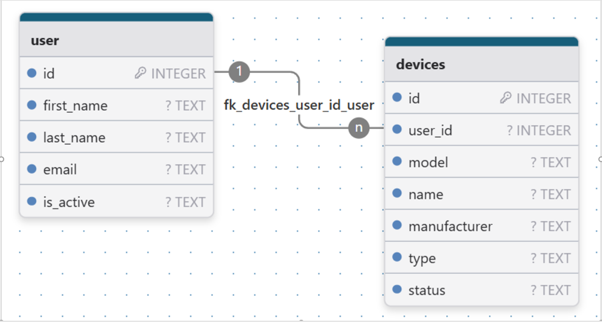
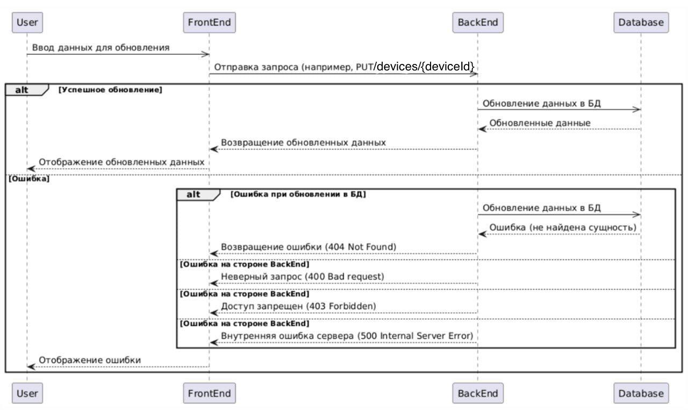

Взяла  спроектированный метод из  swagger`а "умный дом"

Я как пользователь умного дома хочу иметь возможность изменять тип, модель, производителя и название устройства

История версий
| ЗАДАЧА            | ТИП ИЗМЕНЕНИЯ                     | ЦВЕТ ИЗМЕНЕНИЯ| ДАТА       | АВТОР    
|-------------------|-----------------------------------|---------------|------------|----------
| ссылка на задачу  | Создано                           |               | 01.03.2025 | Иванова А
| ссылка на задачу  | Изменено (указать раздел и пункт) | синий         | 10.03.2025 | Иванова А

Бизнес- анализ 
- ссылка 

Назначение и цель

Изменение полей с информацией об устройстве по его уникальному номеру

Предварительные действия
- Реализована модель данных в СУБД: 

- Пользователь прошел аутентификацию и авторизацию
- Пользователь находится на странице устройства, форма с редактированием данных заполнена данными об этом устройстве из GET запроса по адресу https://.../{deviceId}

Ограничения по ролям
- Доступ к интерфейсу возможен для авторизованного клиента

Макеты
- ссылка на Figma/Pixco/draw.io итд

Основной сценарий (успешный сценарий)
1.	Пользователь редактирует содержимое формы  
2.	Front делает запрос на Back PUT /devices/{deviceId}(ссылка на API) 
3.	Front отображает детальную информацию по устройству в соответствии с п.Макеты

Альтернативный сценарий

При вводе некорректных данных:
1.	Пользователь вводит недопустимые данные (например, пустой тип или модель).
2.	Система показывает сообщение об ошибке валидации.
3.	Пользователь исправляет данные или отменяет операцию.

Исключительный сценарий 

При получении ошибок 4хх или 5хх от Back-end системы: 
1. Отображает пользователю уведомление об ошибке
2. Предлагает пользователю: 
- Повторить запрос
- Обратиться в службу поддержки
1. Логирует техническую информацию об ошибке для диагностики

Требования к интерфейсу

| НАЗВАНИЕ АТРИБУТА| ТИП| ДЛИНА| РЕДАКТИРУЕМОСТЬ| МАСКА ВВОДА/ОТОБРАЖЕНИЕ| ОБЯЗАТЕЛЬНОСТЬ|СОРТИРОВКА|ЗНАЧЕНИЕ ПО УМОЛЧАНИЮ| ИСТОЧНИК ДАННЫХ| ПРИМЕЧАНИЯ |
|-----------------------|-------|-------|-----------------|-------------------------|----------------|-------------|-------------|-------------|-------------|
|Название устройства    | label | 20    |   +  | -   | +   | -   |  -   |   front  | "название устройства"      |
|Тип устройства         | label | 20    |   +  | -   | +   | -   |  -   |   front  | "тип устройства"           |
|Производиель устройства| label | 20    |   +  | -   | +   | -   |  -   |   front  | "производитель устройства" |
|Модель устройства      | label | 20    |   +  | -   | -   | -   |  -   |   front  | "модель устройства"        |

Результат

Клиент изменил поля с информацией для определенного устройства

PUT /devices/{deviceId} Обновить информацию об устройстве

История версий

| ЗАДАЧА           | ТИП ИЗМЕНЕНИЯ | ЦВЕТ ИЗМЕНЕНИЯ | ДАТА       | АВТОР     |
|------------------|---------------|----------------|------------|-----------|
| ссылка на задачу | создано       |                | 10.06.2025 | ИВАНОВА А |

Сервис 

Микросервис devices

Алгоритм вызова

Sequence UML вставить картинку в ДЗ
Пользователь, Фронт, Бек, БД – обязательные акторы для диаграммы + альтернативные сценарии

Свойства вызова

| СВОЙСТВО                | ОПИСАНИЕ   |
|-------------------------|------------|
| тип взаимодействия      | REST       |
| формат запроса/ответа   | JSON       |
| тип вызова              | синхронный |
| протокол взаимодействия | HTTPS      |
| способ аутентификации   | JWT        |

Формат запроса

| ПАРАМЕТР | ТИП    | ДЛИНА| РАСПОЛОЖЕНИT (path/query) | ОБЯЗАТЕЛЬНОСТЬ | ОПИСАНИЕ                           |
|----------|--------|------|---------------------------|----------------|------------------------------------|
| deviceId | integer| -    |path                       | +              |уникальный идентификатор устройства |

Пример

PUT/devices/40781000287777000002

| ПАРАМЕТР     | ТИП    | ДЛИНА | РАСПОЛОЖЕНИЕ | ОБЯЗАТЕЛЬНОСТЬ | ОПИСАНИЕ                | МЕСТО ДЛЯ СОХРАНЕНИЯ|
|--------------|--------|-------|--------------|----------------|-------------------------|---------------------|
| name         | string | 20    | body         | +              | имя устройства          | device.name         |
| type         | string | 20    | body         | +              | тип устройства          | device.type         |
| manufacturer | string | 20    | body         | +              | прозводитель устройства | device.manufacturer |
| model        | string | 20    | body         | +              | модель устройства       | device.model        |

Пример 

{
  "name": "Пример имени",

  "type": "Пример типа",

  "manufacturer": "Пример производителя",

  "model": "Пример модели"
} 

Формат ответа

| ПАРАМЕТР    | ТИП    | ДЛИНА | ОБЯЗАТЕЛЬНОСТЬ | ОПИСАНИЕ                 | ИСТОЧНИК ДАННЫХ     | ОТОБРАЖЕНИЕ НА ФРОНТЕ |
|-------------|--------|-------|----------------|--------------------------|---------------------|-----------------------|
| name        | string | 20    | +              | название устройства      | device.name         |                       |
| type        | string | 20    | +              | тип устройства           | device.type         |                       |
| manufacture | string | 20    | +              | производитель устройства | device.manufacturer |                       |
| model       | string | 20    | -              | модель устройства        | device.model        |                       |

Пример 

{
  "name": "Пример имени",

  "type": "Пример типа",

  "manufacturer": "Пример производителя",

  "model": "Пример модели"
} 

Коды ответов 

| КОД | НАЗВАНИЕ              | ОПИСАНИЕ                  | ПОВЕДЕНИЕ СИСТЕМЫ   |
|-----|-----------------------|---------------------------|---------------------|
| 200 | OK                    | запрос обработан          | продолжить процесс  |
| 400 | Bad Request           | неверный запрос           | отобразить ошибку   |
| 403 | Forbidden             | доступ запрещен           | отобразить ошибку   |
| 404 | Not found             | устройство не найдено     | отобразить ошибку   |
| 500 | Internal Server Error | внутренняя ошибка сервера | отобразить ошибку   |

Алгоритм обработки запроса

1.	Back при получении запроса, валидирует JWT, получает user_id из токена. Далее обращается в таблицу user и device, находит список устройств пользователя и проводит валидацию на совпадение. Сохраняет в памяти ответ по заданному ID.

2.	Back по найденному устройству в соответствии с п.Формат ответа обновляет запись в БД:
UPDATE devices d
SET d.model = request_model,
    d.name = request_name,
    d.manufacturer = request_manufacturer,
    d.type = request_type
WHERE d.id = request_id;
Где request_model – model, request_name – name, request_manufacturer – manufacturer, request_type – type из тела запроса, а request_id – deviceId из пути запроса

3.	Back повторно делает запрос к БД с поиском по ID из запроса и формирует ответ на front в соответствии с п.Формат:
SELECT * 

FROM devices d 

WHERE d.id = request_id;

Где request_id – deviceId из пути запроса

Альтернативные процессы

Ошибки 4хх, 5хх

1. Back вернуть ошибку с текстом на Front в соответствии с п. Коды ответов

