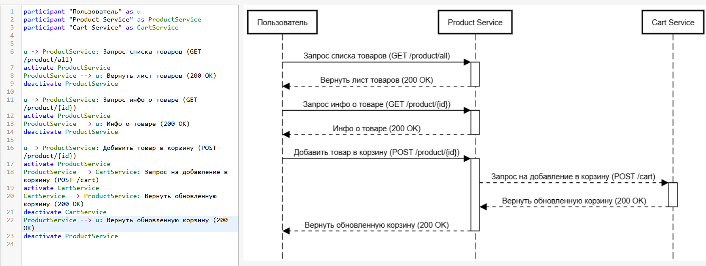

# ЗАДАНИЕ:

Представим, что Вы работаете аналитиком и проектируете работу приложения интернет-магазина. Вам нужно заложить и спроектировать следующий сценарий: отображение витрины товаров (список товаров с кратким описанием), переход с витрины на экран с детальным описанием конкретного товара, добавление товара в корзину.

Что нужно сделать:

1.	Спроектируйте REST API, которые нужны для реализации описанного сценария. Решение должно включать описание запросов и описание или пример ответа для каждого из запросов в формате JSON. Способ описания - на ваше усмотрение. По составу полей товара можете ориентироваться на любой известный интернет-магазин.
2.	Постройте Sequence UML диаграмму для этого сценария.

# РЕШЕНИЕ:

1. [Ссылка на описание REST API в yaml](./openapi/интернет-магазин.yaml)
2. 

