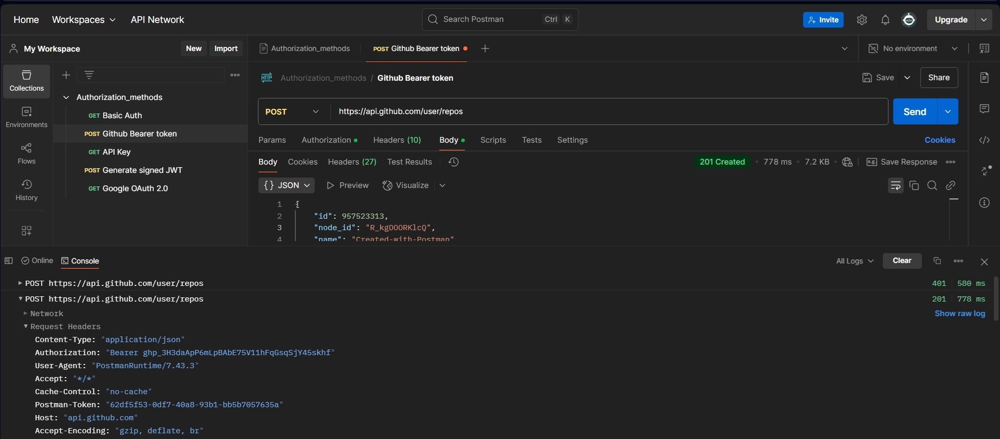
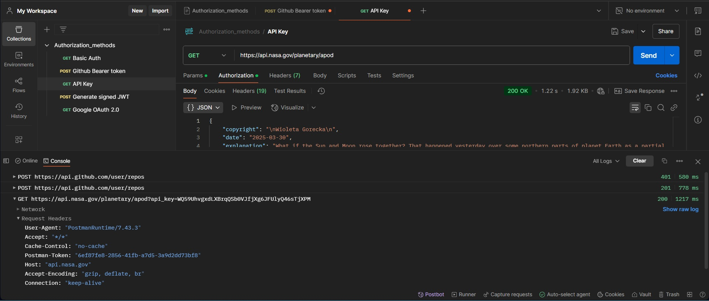

# Задание:

- Импортировать коллекцию Postman с практической части вебинара в
https://www.postman.com/
- Создать Bearer token на Github по документации в Postman
- Отправить запрос с полученным токеном и получить успешный ответ
- Создать API Key в NASA по документации в Postman, повторить п.3

# Решение: 

Bearer token на Github:

 

API Key в NASA:

 