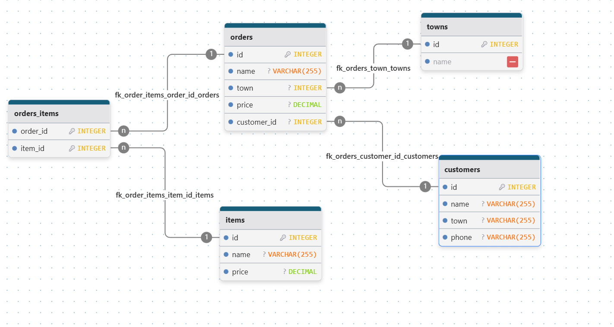

# ЗАДАНИЕ:

В базе данных есть таблица заказов - orders. В ней есть поля: id (идентификатор заказа), name (название заказа), town (адрес доставки заказа), price (цена заказа), customer_id (идентификатор покупателя). Также есть таблицы: towns (справочник адресов), items (товары), customers (покупатели). Известно, что между orders и items предполагается связь многие-ко-многим.

Что нужно сделать:

Спроектируйте ER-диаграмму с учетом этих вводных. Состав полей таблиц укажите на свое усмотрение с учетом условия, но для таблицы orders учтите те поля, что указаны.

# РЕШЕНИЕ:

 

