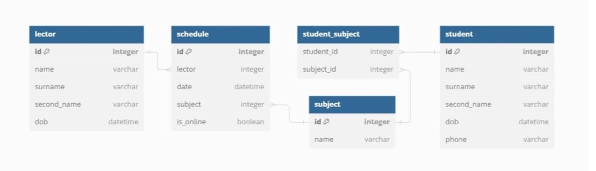

# ЗАДАНИЯ:

1. Постройте модель данных РСУБД (реляционной системы управления базами данных) для хранения
информации о процессе обучения в Учебном Центре. Для этого опишите сущности (таблицы), атрибуты
(наборы полей), типы данных, обязательность заполнения, первичные и внешние ключи, а также связи
между сущностями.

Подсказка: Таблицы, которые может включать база данных: «Студенты», «Лекторы», «Дисциплины»,
«Расписание» и т.д.

Допущения:

- Один студент может посещать несколько дисциплин

- Лектор может вести несколько дисциплин

# РЕШЕНИЕ:

 

