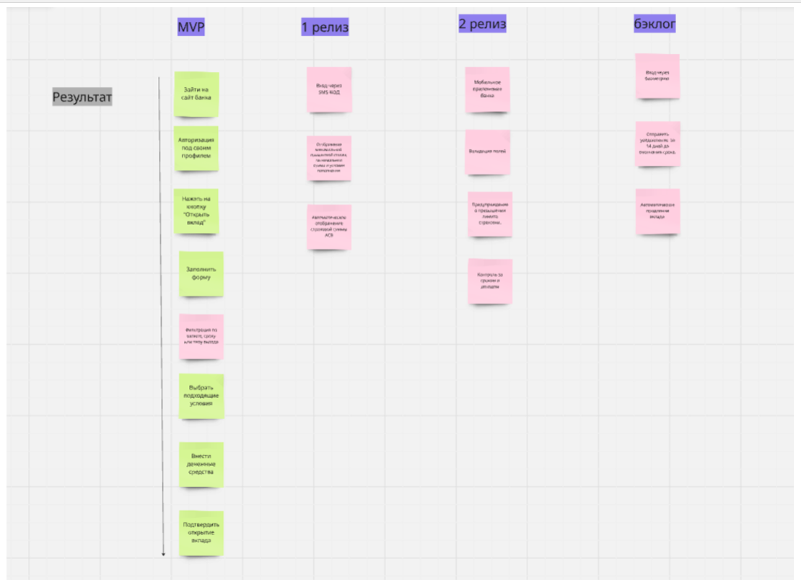

# Задание:

1.	Выбрать предметную область;

2.	Описать проблематику и цель (AS-IS и TO-BE);

3.	Составить 3-5 и более User Story;

4. Сформулировать 3-5 нефункциональных требования;

5. Сформулировать 3-5 функциональных требования;

6. Выбрать 3 критерия качества и написать на каждый по «плохому» требованию (для которого этот критерий не выполняется);

7. Сформировать User Story Map, выделив MVP, следующий релиз и бэклог.

# Решение:

1. Предметная область: Положить деньги на вклад банка.

2. Описание проблематики и цели:

 AS-IS:

 клиенту сложно принять решение об открытии вклада, т.к. приходится рассчитывать доходность самостоятельно или идти в банк.

TO-BE:

 клиенту будет проще принять решение об открытии вклада, т.к. можно будет сделать предварительный расчет доходности за указанный срок через сайт банка.

3. USER STORY:
   
- Как клиент, я хочу заполнять онлайн-заявки по открытию вклада через мобильное приложение банка, чтобы открывать вклады без посещения отделение банка
- Как клиент, я хочу получить предварительный расчет по вкладу через  сайт банка, чтобы выбрать вклад с выгодными 
- Как клиент, я хочу получать уведомление о начислении процентов по смс, чтобы отслеживать доходность
- Как сотрудник банка, я хочу вносить новые ставки и условия вклада , чтобы клиенты видели актуальную информацию
- Как клиент, я хочу получить уведомление об изменение процента вклада и условий вклада, чтобы не потерять выгоду

4. NFT:

- Функциональность открытия вклада в банке должна быть доступна с домашней страницы
- Система должна обрабатывать операции по внесению и выводу денежных средств в течение 3 секунд, а при большой нагрузке на сервере до 5 секунд
- Система должна быть доступна для пользователей с ограниченными возможностями
- Система должна обеспечивать защиту конфиденциальных данных пользователя в соответствии с GDPR
- Интерфейс должен быть визуально  соответствовать бренду банка

5. FT:

- Система должна предоставить предварительный расчет по вкладу.
- Система должна предоставлять доступ только авторизованным пользователям.
- Система должна запросить код подтверждения при открытие вклада.
- Система должна предоставить возможность выбрать вклад по различным критериям, таким как срок, процент.

6. Критерии качества:
   
- Недвусмысленность. Система должна предоставить условия получения вклада в виде азбуке морзе.

 Причина: Условия должны быть написаны на понятном языке, чтобы пользователь не тратил лишнее время на перевод на свой язык.

- Трассируемость. Система не будет фиксировать вложенные деньги во вклад.

 Причина: Любые действия связанные по вкладу должны фиксироваться в системе.

- Непротиворечивость. Система должна оповестить клиента об изменении ставки по вкладу по адресу электронной почты , но письмо не должно содержать персональные данные.
 
 Причина: Система не сможет отправить письмо клиенту, так как адрес электронной почты является персональными данными.

7. USER STORY MAP:

 https://miro.com/app/board/uXjVIM2_Q04=/?share_link_id=877584781211 

