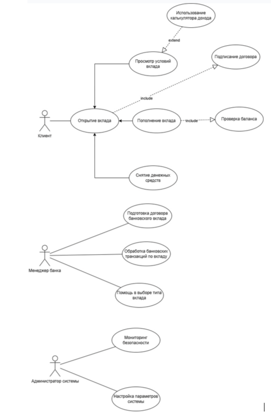
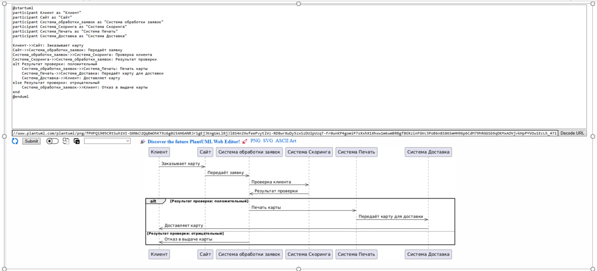

# Задание:

1. Составить Use Case диаграмму
- 3-5 акторов;
- Все 3 вида связей.

2. Составить Sequence диаграмму
Мы хотим реализовать процесс заказа карты через сайт.
Процесс выглядит следующим образом:
- Cначала клиент заказывает карту на сайте;
- Заявка попадает в Систему обработки заявок;
- Далее клиент проверяется в системе Скоринга (можно ли выдавать ему карту);
- Затем карта печатается в системе Печать;
- И доставляется через систему Доставка.

Итого у нас есть 5 систем: Сайт, Система обработки заявок, Скоринг, Печать, Доставка.
Каждая система для нас является чёрным ящиком. Добавлять или удалять системы нельзя.

Необходимо составить sequence диаграмму, которая будет отражать работу системы.
В диаграмме отразить альтернативный сценарий, например для Скоринга.

# Решение:

1. USE CASE: Система открытия вклада в банке.

2. Sequence диаграмма:

