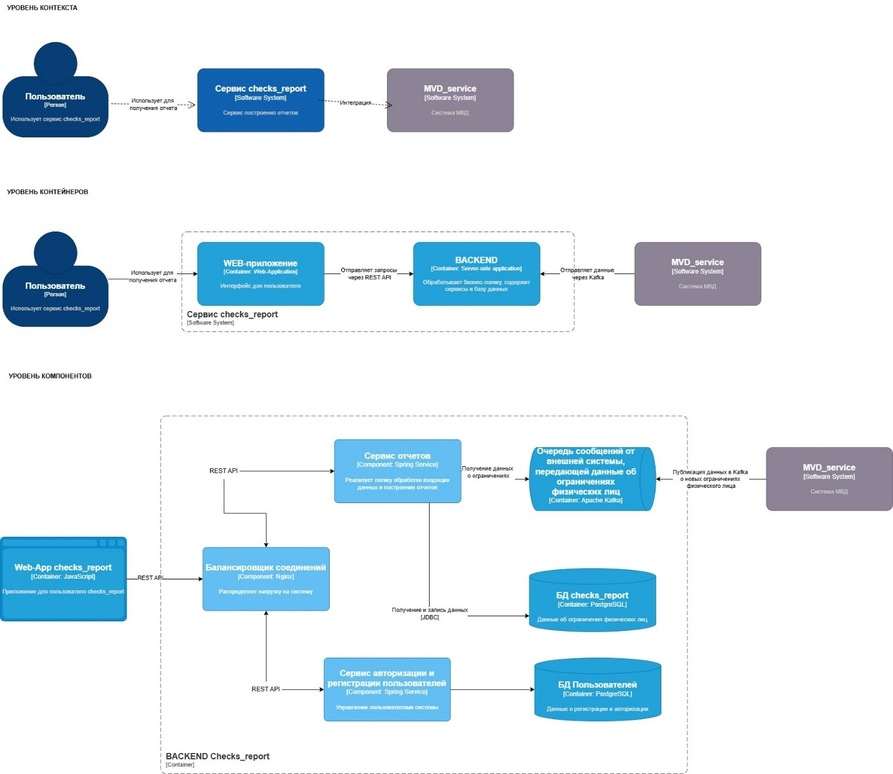

Ориентир: сайт «за честный бизнес»

Сервис, отображает информацию, полученную из
внешней системы с помощью Кафки.

## Оглавление

###  Глоссарий

###  Бизнес-контекст

- Цели и задачи сервиса

- Область применения

- Границы системы	

### Схемы и диаграммы	

### Функциональные требования	

### Нефункциональные требования	

-----

## Глоссарий

Apache Kafka — это распределённая система, предназначенная для обработки потоков данных в режиме реального времени или асинхронно. Apache Kafka называют брокером сообщений, тк она выступает в качестве посредника между интегрирующимися системами.

API — интерфейс взаимодействия, предоставляющий доступ к данным и функциям сервиса другим системам.

Consumer — компонент, подписанный на Kafka-topic, который вычитывает сообщения. 

Dead Letter Queue (DLQ) — это очередь, топик, куда могут перенаправляться сообщения, которые не смогли обработать получатели в рамках процесса. 

Kafka Topic — логический канал, очередь для публикации и извлечения сообщений. 

Producer — компонент, публикующий данные в Kafka-topic.

Prometheus — это система мониторинга и оповещения о событиях, хранящая данные в виде временных рядов.

SASL (Simple Authentication and Security Layer) — фреймворк для аутентификации и обеспечения безопасности, целостности и конфиденциальности при обмене данными между пользователем и приложением.

TLS (Transport Layer Security) — криптографический протокол, обеспечивающий защищённую передачу данных между узлами в сети Интернет. 

БД (база данных)-  это набор информации, которая хранится упорядоченно в электронном виде.

ФЛ (физическое лицо)- каждый правоспособный и дееспособный гражданин страны.

------

## Бизнес-контекст

Сервис checks_report предназначен для формирования отчетов о проверке ФЛ по различным БД. В процессе работы сервиса собирается, обрабатывается и хранится информация об ограничениях пользователя. При помощи сервиса люди могут заказать отчет о других людях и сделать выводы стоит ли с ними сотрудничать.

Ежедневно checks_report должен обрабатывать до 100 миллионов запросов. Основной задачей сервиса является предоставление данных о наличии ограничений физического лица.

### Цели и задачи сервиса

Цели сервиса:
1.	Обработка и хранение данных: Сервис получает и обрабатывает информацию об ограничениях ФЛ при помощи Apache Kafka
2.	Доступность данных через API: Сервис предоставляет API для доступа к данным об ограничениях пользователя

Задачи сервиса:
Цели декомпозируются на задачи и описывается (верхнеуровнево, без детализации) каждая из них.
1.	Чтение и обработка данных через Kafka: настроить обработку данных в реальном времени для получения актуальных данных.
2.	Обработать и структурировать данные для дальнейшего использования. Сохранение данных в базе данных
3.	Разработка API для доступа: 
- Создать API для предоставления данных об ограничениях 
- Обеспечить безопасность доступа через аутентификацию и авторизацию

### Область применения

Сервис checks_report будет использоваться пользователями для получения информации об ограничениях физических лиц.

### Границы системы

•	Доступ к данным предоставляется только посредством API.
•	Чтение информации осуществляется только из указанных Kafka-топиков, предназначенных для получения данных о транзакциях.
•	Система не предоставляет возможности изменять исходные данные.
•	Входные данные предоставляются системой МВД в топики, перечисленные в разделе ФТ, за корректность данных ответственна система МВД.

Ограничения и допущения

1.	Обработка запросов: Сервис checks_report должен быть спроектирован с расчетом на пропускную способность в 10 000 запросов в секунду, что позволит эффективно справляться как с постоянной нагрузкой, так и с пиковыми нагрузками.
2.	Задержка обработки данных: Система должна обеспечивать минимальную задержку при обработке данных. Время обработки каждого сообщения не должно превышать 200 миллисекунд.
3.	Общая задержка для конечного пользователя: Система должна обеспечить ответ конечному клиенту на запрос транзакции в течение не более 1 минуты.
4.	Масштабируемость и устойчивость: Система должна быть масштабируемой, что означает возможность увеличения вычислительных ресурсов и пропускной способности при росте объема данных и числа запросов. Это обеспечит стабильную работу сервиса даже в условиях увеличивающейся нагрузки, например, при добавлении новых источников проверок.

-----

## Схемы и диаграммы 

-----

## Функциональные требования

1.	Подключение к Kafka

 1.1. Необходимо подключиться к кластеру Кафка: analytics-kafka-cluster

 1.2. Подключение должно осуществляться через безопасный протокол (SSL/TLS).

 1.3. Аутентификация через SASL.

 1.4. Устойчивость к сбоям при подключении: необходимо настроить механизмы повторных попыток и таймаутов:
  - Retries: 5;
  - Heartbeat Interval: 3 секунды;
  - Session Timeout: 15 секунд.
  
2. Подписка на топики
    

 2.1. Сервис должен получать данные из топика mvd_restrictions

 2.2. Сервис должен поддерживать настройку смещения для чтения сообщений из топика. Смещение должно быть настраиваемо динамически, при помощи параметров, без изменений кода и пересборки дистрибутива. Варианты настройки:

  2.2.1. earliest: начать с первого сообщения в топике. Это необходимо при первом запуске сервиса, чтобы обработать все доступные сообщения.

  2.2.2. latest: начать с последнего сообщения в топике. Этот вариант подходит, если нужно обрабатывать только новые сообщения, пропуская старые.

  2.2.3. custom: возможность указания конкретного смещения (например, для восстановления после сбоя или при повторной обработке определенных данных).

 2.3. Параметр auto.commit = true, auto.commit.interval.ms = 5000 (5 сек)

 2.4. Параметры топика mvd_restrictions:

| ТОПИК            | НАЗНАЧЕНИЕ | ПРИМЕР СТРУКТУРЫ ДАННЫХ | ЧИСЛО РАЗДЕЛОВ| MAX ВРЕМЯ ХРАНЕНИЯ ДАННЫХ| MAX РАЗМЕР СООБЩЕНИЯ| ПРИЛЛОЖЕНИЕ-ПРОДЮСЕР| ПРИЛОЖЕНИЕ-ПОТРЕБИТЕЛЬ | КЛЮЧ ПАРТИЦИОНИРОВАНИЯ |
| -----------------|------------|-------------------------|---------------|--------------------------|---------------------|------|-------|------|
| mvd_restrictions | ограничения физических лиц |         | 5             | 1 неделя                 | 1 MB                | mvd_service | checks_report | Название кодекса правонарушения (restriction_source) |

3.	Обработка сообщений

3.1.	Необходимо реализовать параллельную обработку сообщений. 

3.2.	В случае, если в Кафка одно и то же событие придет несколько раз, необходимо, чтобы сервис корректно обрабатывал дубликаты.

3.3.	После успешной обработки сообщения сервис отправляет подтверждение в Kafka, указывая последний обработанный offset.

3.4.	Если сервис перезапускается или теряет соединение с Kafka, он начинает читать с последнего подтвержденного сообщения, избегая повторной обработки.

4.	Обработка ошибок и восстановление

4.1.	Сервис автоматически пытается восстановить соединение в течение заданного времени (30 секунд).

4.2.	Если после нескольких попыток (3 попытки) соединение не восстанавливается, сервис генерирует ошибку и уведомляет администратора.

4.3.	Обработка сообщений с ошибками (Dead Letter Queue). Если сообщение невозможно обработать из-за ошибок (например, неверный формат данных), оно направляется в Dead Letter Queue (DLQ). Эти сообщения могут быть проверены и исправлены позже.

5.	Сохранение данных в базе данных.

Обработанные данные должны сохраняться в базе данных (PostgreSQL) для последующего доступа и анализа. Система должна обеспечивать транзакционную целостность при записи данных и поддерживать эффективное управление ошибками, включая возможность отката в случае необходимости. 

5.1.	БД: checks_report

5.2.	Схема: checks_report 

5.3.	Таблица: mvd_restrictions

6.	Соответствие полей сообщения полям базы данных (маппинг на поля БД, source2target)

Маппинг:

| ПРИМЕР СООБЩЕНИЯ | ПОЛЕ СООБЩЕНИЯ     | ТИП ДАННЫХ В СООБЩЕНИЯХ | ПОЛЕ В ТАБЛИЦЕ БД | ТИП ДАННЫХ В БД | ОПИСАНИЕ |
|------------------|--------------------|-------------------------|-------------------|-----------------|----------|
|                  | Passport           | string                  | passport          | text            | Номер паспорта нарушителя |
|                  | Person_name        | string                  | person_name       | text            | Имя нарушителя |
|                  | Person_surname     | string                  | person_surname    | text            | Фамилия нарушителя |
|                  | Person_patronomic  | string                  | person_patronomic | text            | Отчество нарушителя |
|                  | Restriction_source | string                  | restriction_source| text            | Источник правонарушения |
|                  | Restriction        | number                  | restriction       | text            | Номер или описание ограничения |
|                  | Restriction_date   | string                  | Restriction_date  | timestamp       | Дата правонарушения |

## Нефункциональные требования

Производительность: Сервис должен обрабатывать 2000 сообщений в секунду в обычном режиме. При увеличении нагрузки система должна быть способна обрабатывать до 10 000 сообщений в секунду без сбоев. 

Безопасность: Для защиты данных, передаваемых по сети, необходимо использовать шифрование TLS_1.2. При работе с базой данных следует применять принцип минимальных привилегий, чтобы каждый пользователь и сервис имел доступ только к тем данным, которые ему необходимы. 

Логирование и обработка ошибок: Если при маппинге или записи в базу данных возникает ошибка, сервис должен логировать её.

Логирование событий: Когда сервис подключается или отключается от Kafka, эти события фиксируются в логе, чтобы отслеживать состояние соединения.

Необходимо логировать все сообщения, которые не могут быть обработаны сервисом. При этом, должен быть счетчик общего количества прочитанных и успешно обработанных сообщений.
Сервис должен быть интегрирован с системой мониторинга Prometheus, которая собирает метрики о работе сервисов и отображает их в виде графиков. Это помогает отслеживать производительность в реальном времени и оперативно реагировать на проблемы. 

Метрики:

Количество обработанных сообщений за час: 10,000 сообщений

Ошибки при обработке за последний час: 5 ошибок

Средняя задержка при обработке сообщений: 0.3 секунды на сообщение
