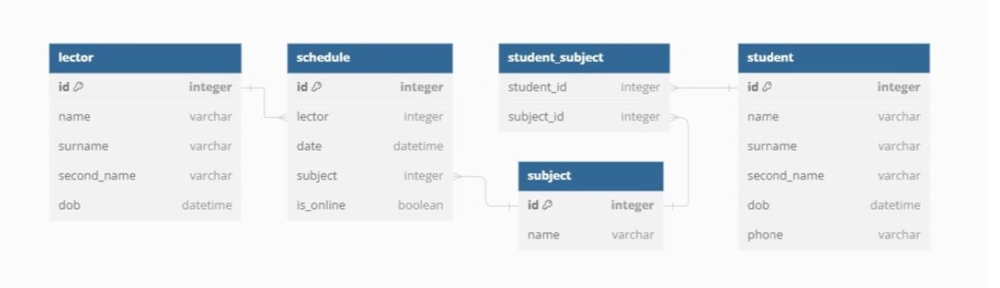

# ЗАДАНИЕ:

1. Напишите SQL-запросы к спроектированной схеме БД, которые выведут:

1.1. Перечень дисциплин, к которым прикреплены более 5 студентов.

Набор возвращаемых полей: Наименование дисциплины, Количество студентов, прикрепленных к
дисциплине

1.2. Средний возраст лекторов по дисциплине «Системный анализ» на текущий день.

Набор возвращаемых полей: цифра.

1.3. Список студентов, у которых не указан мобильный телефон.

Набор возвращаемых полей: Фамилия, Имя, Отчество выведены в поле с наименованием «ФИО»

Подсказки:

- Мобильный телефон может быть не указан, когда поле «мобильный телефон» является
необязательным
- Используйте конкатенацию полей «Фамилия», «Имя», «Отчество»

1.4. Рейтинг популярности дисциплин среди студентов таким образом, что первое место будет занимать
дисциплина с наибольшим количеством прикрепленных студентов.

Набор возвращаемых полей: Номер места в рейтинге, Наименование дисциплины, Количество
студентов на дисциплине

Подсказки:

- По желанию можно воспользоваться оконной функцией row_number() для вывода номера
дисциплины в рейтинге

- Группировку можно производить по наименованию дисциплины

1.5. Список занятий по «Системный анализ», проведенных в формате «Онлайн» за текущий месяц
(занятия, проводимые в текущий день должны попасть в выборку)

Набор возвращаемых полей: Название дисциплины, Дата проведения занятия, Название формата

Подсказка: Не забудьте исключить занятия, которые еще только будут проведены в текущем месяце

# РЕШЕНИЕ:

1.1.  Перечень дисциплин, к которым прикреплены более 5 студентов
   
SELECT

d.name, count(s.*)

FROM subject d

LEFT JOIN student_subject s ON s.subject_id = d.id

WHERE (SELECT count(*) FROM student_subject st WHERE st.subject_id = d.id) > 4 GROUP BY d.id

1.2.  Средний возраст лекторов по дисциплине «Системный анализ» на текущий день

SELECT

avg(date_part('year',age(l.dob::date)))

FROM lector l

JOIN schedule s ON s.lector = l.id

JOIN subject d ON d.id = s.subject  WHERE d.name = 'Системный анализ';

1.3. Список студентов, у которых не указан мобильный телефон

SELECT

CONCAT_WS(' ', surname, name, second_name) 

FROM student s

WHERE s.phone IS NULL

1.4. Рейтинг популярности дисциплин среди студентов таким образом, что первое место будет занимать дисциплина с наибольшим количеством прикрепленных студентов

SELECT 

row_number()

OVER (ORDER BY count(s.) DESC), d.name, count(s.) 

FROM subject d

LEFT JOIN student_subject s ON s.subject_id = d.id GROUP BY d.id

1.5. Список занятий по «Системный анализ», проведенных в формате «Онлайн» за текущий месяц
(занятия, проводимые в текущий день должны попасть в выборку)

SELECT d.name, s.time, s.is_online

FROM schedule s

JOIN subject d ON d.id = s.descipline

WHERE DATE_TRUNC('month', time) = DATE_TRUNC('month', CURRENT_DATE)

AND s.time <= CURRENT_DATE AND s.is_online = true

